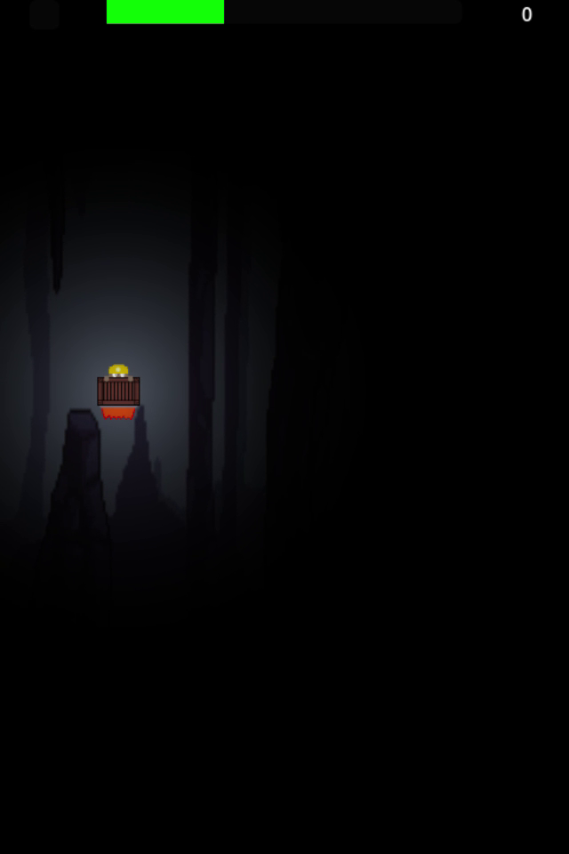
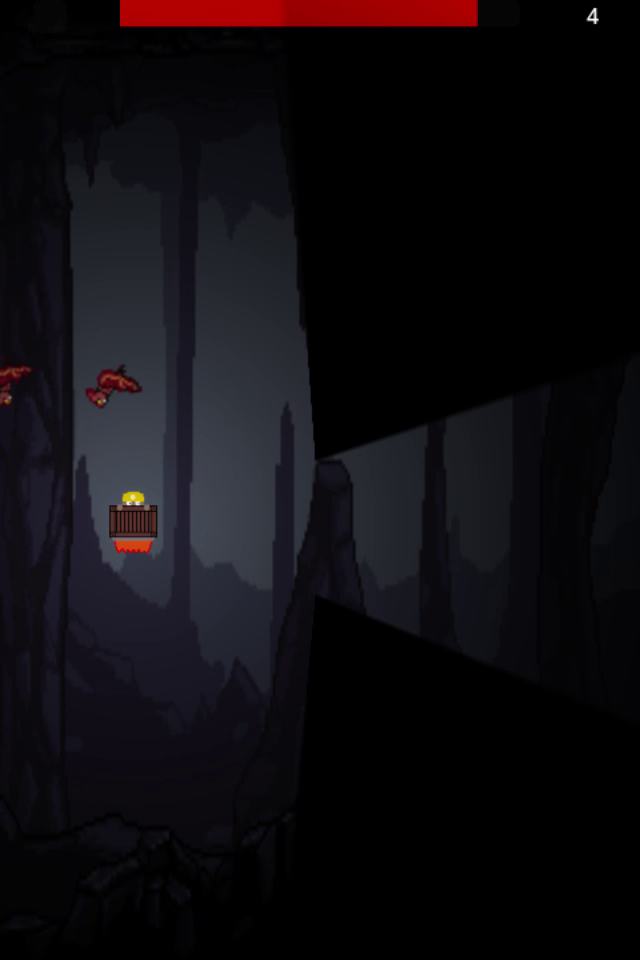

# Rockety Dwarf

Rockety Dwarf is a simple clicking game inspired by Flappy Bird. However instead of just the jump. You now need to keep track of the amount of light in the room. If it gets too bright you may awaken sleeping animals in the cave.

## How to play

Click on the up arrow to jump and the left arrow to brighten your lantern. Dont forget to dodge the obstacles!

## Screenshots

 

## Building

Recommended way is to follow the instructions for building for your desired architecture here: https://docs.godotengine.org/en/stable/tutorials/export/exporting_projects.html
